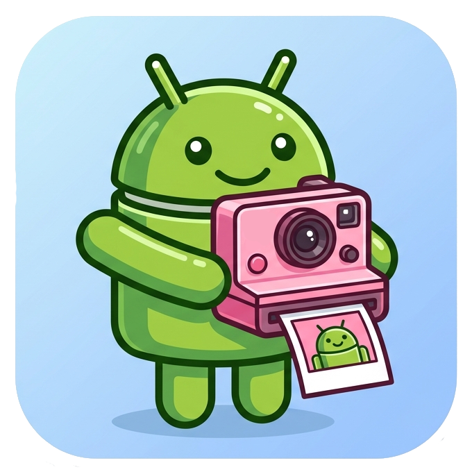

# Polaroid

[](https://github.com/mikimn/polaroid/actions/workflows/ci.yml)

This library enables working with UVC cameras on Android. It is based on `libuvc` and is heavily inspired by the [`UVCCamera`](https://github.com/saki4510t/UVCCamera) project.




## Getting Started

Polaroid is an Android library (`:libpolaroid`) that opens a USB Video Class camera and streams its frames to a `Surface`. It is not published to a Maven repository yet, so add it to your project as a module.

### Requirements

- Android `minSdk 24`, arm64-v8a or x86_64 device (USB host support required)
- JDK 17, Android SDK 35, NDK `30.0.16248370` and CMake `3.22.1` (installable from the SDK Manager)

### Add the library

1. Add this repository as a git submodule (or copy it) and include the module in `settings.gradle`:

   ```bash
   git submodule add https://github.com/mikimn/polaroid.git polaroid
   git submodule update --init --recursive
   ```

   ```groovy
   include ':libpolaroid'
   project(':libpolaroid').projectDir = new File('polaroid/libpolaroid')
   ```

2. Depend on it from your app module:

   ```kotlin
   implementation(project(":libpolaroid"))
   ```

3. Declare USB host support and the camera permission in your `AndroidManifest.xml`. Android requires `CAMERA` to open UVC devices over USB:

   ```xml
   <uses-feature android:name="android.hardware.usb.host" android:required="false" />
   <uses-permission android:name="android.permission.CAMERA" />
   ```

### Use the API

The API is deliberately small:

| API | Purpose |
| --- | --- |
| `UsbManager.uvcDevices()` / `UsbDevice.isUvc` | Find attached UVC cameras |
| `UvcCamera.open(fd)` | Open a camera from the file descriptor of a `UsbDeviceConnection` |
| `UvcCamera.start(surface, width, height, fps)` | Stream to a `Surface`; returns the `StreamSize` actually negotiated |
| `UvcCamera.stop()` / `close()` | Stop streaming / release the camera |

```kotlin
val usb = context.getSystemService(UsbManager::class.java)
val device = usb.uvcDevices().first()

// 1. Ask the user for access (shows the system dialog; handle the result via your own broadcast).
usb.requestPermission(device, pendingIntent)

// 2. Once granted, open the device. Keep the connection open for as long as the camera is used.
val connection = usb.openDevice(device)!!
val camera = UvcCamera.open(connection.fileDescriptor) // throws IOException on failure

// 3. Stream to a Surface, e.g. from TextureView.SurfaceTextureListener.onSurfaceTextureAvailable.
val size = camera.start(Surface(surfaceTexture), width = 640, height = 480, fps = 30)

// 4. Clean up. Stop before the surface is destroyed, and close the camera before the connection.
camera.stop()
camera.close()
connection.close()
```

Notes:

- `start` picks the closest mode the camera supports (preferring MJPEG, then YUYV), so use the returned `StreamSize` to set your preview's aspect ratio. `StreamSize` is a plain `data class StreamSize(val width: Int, val height: Int)` rather than `android.util.Size`, which keeps the size logic unit-testable on the JVM.
- Use a `TextureView` (or a surface you know is valid). A `SurfaceView` inside Jetpack Compose did not reliably receive its surface on some devices.
- The example app's `ui/camera/` package shows the full flow as small composables.

## Example Application

The `:app` module is a Jetpack Compose app that shows a live preview of the first connected UVC camera.

```bash
git clone --recurse-submodules https://github.com/mikimn/polaroid.git
cd polaroid
```

If you already cloned without submodules, run `git submodule update --init --recursive`.

**Build prerequisites:** JDK 17 (Android Studio's bundled JBR works) and the Android SDK with NDK `30.0.16248370` and CMake `3.22.1`. Point Gradle at your SDK with a `local.properties` file (Android Studio creates it for you):

```properties
sdk.dir=/path/to/Android/sdk
```

**Build and install** on a device with USB host (OTG) support and a UVC camera:

```bash
./gradlew :app:assembleDebug     # build only
./gradlew :app:installDebug      # build and install on the connected device
```

Plug the camera in, open the app and tap **Allow camera access**, accepting the camera permission and the USB permission dialogs. The preview appears once access is granted.

## Contributing

Contributions are welcome. Please open an issue to discuss larger changes first.

- Build the example app (`./gradlew :app:assembleDebug`) and run the unit tests (`./gradlew test`) before opening a pull request. `:libpolaroid` also has instrumented tests that exercise the real JNI layer (no camera needed): `./gradlew :libpolaroid:connectedDebugAndroidTest` on a device or emulator. Test camera-related changes on a real device and camera if you can.
- Third-party code lives in `libpolaroid/src/main/cpp/third_party/` as git submodules (`libusb`, `libuvc`, `libjpeg-turbo`). **Keep them pristine** so they can be updated; never edit files inside them. Build integration belongs in `libpolaroid/src/main/cpp/cmake/` and the top-level `CMakeLists.txt`.
- CI (`.github/workflows/ci.yml`) runs `./gradlew test lint :app:assembleDebug` on pushes to `main` and on pull requests, and fails if a third-party submodule was modified. Run the same command locally before opening a PR.
- The native build is CMake only. Do not reintroduce ndk-build (`Android.mk`) files.
- Keep components small and reusable, in line with the existing composables.
- See `CLAUDE.md` for an overview of the architecture and build setup.

## How AI is Used in the Project

This project is developed with the help of [Claude Code](https://claude.com/claude-code), an AI coding assistant from Anthropic. It was used for tasks such as modernizing the native build (CMake, NDK upgrade, submodule layout), writing the JNI/libuvc streaming layer and the Compose example app, debugging preview issues on a physical device from logs, and drafting documentation (including `CLAUDE.md`, which gives AI agents context about the repository).

AI-generated changes are reviewed by the maintainer and verified by building and running them, including on real hardware. Commits that were co-written with an AI assistant carry a `Co-Authored-By` trailer. Contributors are welcome to use AI tools too, but you remain responsible for understanding, testing and standing behind what you submit.

## License

Polaroid is licensed under the [Apache License 2.0](LICENSE).

It bundles third-party libraries as git submodules that are under their own licenses:

| Library | License |
| --- | --- |
| [libuvc](https://github.com/libuvc/libuvc) | BSD-3-Clause |
| [libjpeg-turbo](https://github.com/libjpeg-turbo/libjpeg-turbo) | IJG, BSD-3-Clause and zlib |
| [libusb](https://github.com/libusb/libusb) | LGPL-2.1-or-later |

Note that libusb is LGPL and is statically linked into `libpolaroid.so`; if you distribute an app built on Polaroid, review the LGPL's requirements for your distribution.
